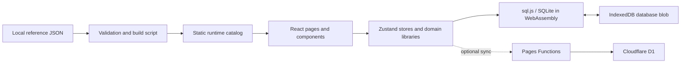

# Architecture

## System summary

This is a browser-first D&D 5e character-sheet application. The device-local SQLite database is the working store; cloud sync is an optional, authenticated mirror for shared campaigns. Reference data is compiled locally into static runtime assets and is deliberately outside the public repository.

## Core components

| Area | Responsibility |
|---|---|
| React UI | Character creation, sheet interaction, dialogs, and route-level composition. |
| Zustand stores | Coordinate UI state with persistence and, when enabled, synchronization. |
| Domain libraries | Parse reference data, calculate rolls, and derive effective character statistics. |
| sql.js + IndexedDB | Run SQLite in the browser and persist its exported database blob between sessions. |
| Build pipeline | Validate local reference JSON and compile static catalog assets for the app. |
| Pages Functions + D1 | Provide optional authenticated sync and campaign collaboration APIs. |

## Key flows

### Startup and local persistence

At startup, the app loads the IndexedDB blob into sql.js, applies ordered SQLite migrations, then renders the React application. Character writes go through the repository layer, flush the SQLite database back to IndexedDB, and update the Zustand store.

### Character calculation

Stored characters retain base choices rather than repeatedly writing calculated results. `deriveCharacterStats` combines those choices with reference data at render time, producing effective abilities, combat values, proficiencies, spell values, and provenance for applied modifiers. This keeps edits reversible and prevents derived effects from being persisted twice.

### Reference data

Local JSON source files are validated and compiled by `scripts/build-data.js` into static assets consumed by the application. The source and generated assets are excluded from the public repository because they are local content, not application code.

### Optional cloud synchronization

The local database remains usable offline. When sync is configured, local writes happen first; asynchronous requests then reconcile changes with the cloud API. The sync layer tracks a per-device base version, detects true concurrent edits, and preserves a backup before a user resolves a conflict. Pages Functions validate Cloudflare Access JWTs before accessing D1.

## Design decisions

- **Local-first persistence:** fast startup and offline use without requiring an account or network connection.
- **SQLite in WebAssembly:** relational storage and explicit migrations without a server dependency for ordinary use.
- **Render-time derivation:** base character choices are stored once; rules effects are calculated transparently for display and rolls.
- **Separate data pipeline:** application code stays distinct from the local reference catalog and its validation rules.
- **Optional sync boundary:** collaboration adds value for groups without making local play dependent on cloud availability.

## Tradeoffs and boundaries

Browser storage favors privacy and offline capability, but users should export backups because browsers can clear local data. The optional sync layer adds conflict handling and server-side authorization complexity in exchange for campaign collaboration.

The public repository contains application code and contributor documentation. It excludes credentials, user data, internal plans, audits, operational records, raw reference data, and generated catalogs. Public configuration examples use placeholders; live production configuration remains restricted.
